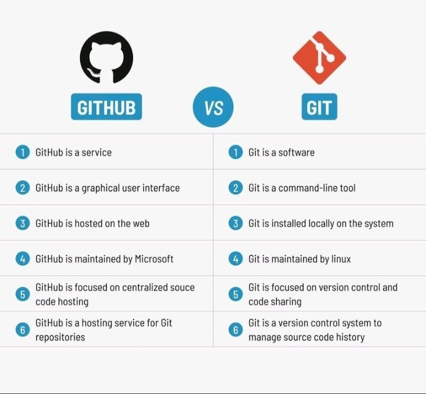

# pwbifor

[github_cheatsheet](materiale/Less01/_cheat_github.pdf)
istruzioni installazione git su pc locale

- Lezione1: Introduzione a GIT-Github [Less01](materiale/Less01/)
- Lezione2: Introduzione pandas datetime [Less02](materiale/Less02/)

## Differences between Github and Git

